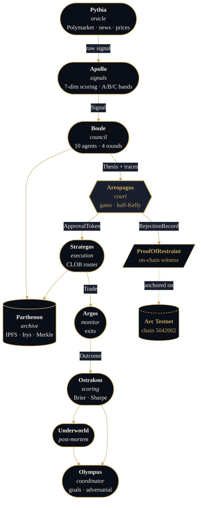

<div align="center">


# Pantheon Trades

**A ten-agent AI council debates every prediction-market trade — and anchors every restraint on-chain.**

[](./contracts)
[](./services)
[](./apps/web)
[](https://testnet.arcscan.app)
[](./LICENSE)

[Live demo](https://pantheon-trades-web.vercel.app) ·
[Architecture](./docs/ARCHITECTURE.md) ·
[Agents](./docs/AGENTS.md) ·
[Constitution](./docs/CONSTITUTION.md)

</div>

---

## The premise

Most automated trading systems optimize for one number: PnL. They have no notion of *why* a trade is right, no record of trades they refused, and no way for the public to verify their discipline.

Pantheon Trades inverts that. Every signal flows through a structured four-round deliberation between ten Greek-god-named AI agents — bulls argue, bears challenge, risk vetoes, execution sizes. The verdict, whether *trade* or *no trade*, is anchored as a cryptographic witness on Circle's Arc Testnet. Discipline becomes auditable. Restraint becomes alpha.

> **First on-chain restraint witness — recorded live during build:**
> [`0xf9ae0e7b…df960e62ba238e53a828dfa4edb`](https://testnet.arcscan.app/tx/0xf9ae0e7ba73ecaece1af840b20e2ef5a20868df960e62ba238e53a828dfa4edb) · block `42,337,549` · `onchain_proof_id = 1`

---

## What's distinctive

| | |
|---|---|
| **Ten agents, four rounds** | Bull pair (Ares, Hades), bear pair (Athena, Cassandra), risk triad (Zeus, Solon, Themis), execution triad (Hephaestus, Daedalus, Humans). Openings → challenges → Athena synthesis → blind votes. |
| **Two veto powers** | Zeus and Solon can halt a trade unilaterally on a constitutional violation. Early-veto short-circuits the debate to save tokens. |
| **Half-Kelly with caps** | Areopagus sizes positions using directional edge and a confidence-weighted half-Kelly fraction, then clamps against constitutional position limits and category exposure. |
| **Proof of Restraint** | When the council declines, Areopagus writes a `Restrained(signalHash, marketId, reasonCode, note)` record to a deployed Solidity contract on Arc. The repo's flagship feature is provably live at [`0x4b35…4895`](https://testnet.arcscan.app/address/0x4b35CE4Bf71B976205f60Fda1EBAb82eD4D34895). |
| **Pluggable LLMs** | `BOULE_LLM_PROVIDER=anthropic` or `gemini`. Provider-specific retry/timeout/throttle logic isolated in `services/boule/src/boule/llm/`. |
| **Portable identities** | ERC-8004 agent passports — councilors carry their reputation across deployments. |

---

## Recent additions (Tier A–G build)

A seven-tier robustness pass landed in 35 commits. Highlights below; full per-feature notes in [docs/CHANGELOG_TIERS.md](./docs/CHANGELOG_TIERS.md).

| Tier | What shipped |
|------|--------------|
| **A — survival foundation** | Prometheus metrics + Grafana dashboard · Polymarket L2 WebSocket depth · correlation-aware portfolio sizing · multi-sig admin migration script for ProofOfRestraint · Hypothesis property tests across sizing / calibration / slippage. |
| **B — execution quality** | Drawdown-adjusted Kelly · walk-forward / decayed calibration windows · Argos resolution-lag state machine · Strategos maker/taker chooser · online slippage learner that refines from realised fills. |
| **C — intelligence** | Pluggable RAG (in-memory cosine + optional ChromaDB) over resolved markets · Eris adversarial dissenter against council groupthink · reflection-driven prompt evolution from Underworld post-mortems · agent ablation via leave-one-out council Brier · Nitter RSS X/Twitter sentiment with built-in VADER-style scorer. |
| **D — venues + data** | Kalshi venue connector · DeFiLlama TVL + stablecoin flows + yields · TradingView screener adapter · spaCy/regex news-headline NER and market matcher. |
| **E — operational maturity** | Alembic async migrations · hourly Postgres + Redis backup compose service · Mozilla SOPS + age secrets · slowapi global rate limiting · `/health/deep` probes (Redis info / DB version / RPC chainId / IPFS id). |
| **F — frontend** | Pure-SVG trace Sankey · line + bar chart primitives + perf metrics (equity, rolling Sharpe, max DD) · manual trade-approval card · Brier-ranked agent leaderboard. |
| **G — safety hygiene** | mutmut mutation testing scaffold · Shopify Toxiproxy chaos drills · a16z Halmos symbolic specs for ProofOfRestraint + PantheonConstitution · IRS Form 8949 tax CSV export. |

Every upstream picked is open-source MIT/Apache and runs without paid vendors: ChromaDB, Nitter, Kalshi REST, DeFiLlama public API, tradingview-screener, spaCy, Alembic, SOPS + age, slowapi, mutmut, Toxiproxy, Halmos.

---

## How it works



Every box emits structured `TraceEvent`s to Redis. The `/demo` route in the web app replays a captured deliberation event-by-event so you can watch a council form an opinion in real time.

---

## The council


> ⚡ veto power · ✦ also writes the round-3 synthesis

Twelve additional agents orchestrate (Apollo, Boule, Areopagus, Strategos, Argos, Ostrakon, Parthenon, Pythia, Elysium, Underworld, Moirai, Olympus) — full roster in [docs/AGENTS.md](./docs/AGENTS.md).

---

## Quick start

**Local dev — full stack:**

```bash
# clone, install, copy env
git clone https://github.com/NAME0x0/Pantheon-Trades
cd Pantheon-Trades
pnpm install
cp .env.example .env       # then fill in keys (see below)

# bring up Postgres + Redis + IPFS + every service
docker compose up -d

# run gates
pnpm test                  # node + python suites
forge test --root contracts # 51 tests across 18 suites
python tests/bench.py      # full microbenchmark + bench harness
```

**Just the demo site:**

```bash
pnpm --filter @pantheon/web dev
# open http://localhost:3000
```

**Fire one real restraint witness on Arc Testnet:**

```bash
uv run python tests/dry_run_chain_write.py
# → Arcscan link printed at end
```

**Required env keys** (full list in [`.env.example`](./.env.example)):

| Key | Purpose |
|-----|---------|
| `ANTHROPIC_API_KEY` *or* `GEMINI_API_KEY` | Council deliberation |
| `RPC_URL`, `PRIVATE_KEY`, `CHAIN_ID` | Arc Testnet writes |
| `PROOF_OF_RESTRAINT_ADDRESS` | Enables on-chain restraint anchoring |
| `DATABASE_URL`, `REDIS_URL` | Service backbone |
| `POLYMARKET_API_KEY/SECRET/PASSPHRASE` | Live CLOB execution (optional) |

---

## Verification gates

This repo treats correctness as a deploy gate, not a hope. The current `main` passes:

```
forge test               20 suites · 51 tests + 2 symbolic specs · 0 failed
halmos                   ProofOfRestraint + PantheonConstitution invariants proved
python -m compileall     320+ files · 0 syntax errors
pytest sweep             334+ tests across 12 service suites
docker compose config    valid (incl. observability + backup stack)
pnpm install             frozen-lockfile clean
pnpm --filter web build  56 routes · /demo first-load 122 kB
tests/bench.py           every microbenchmark gate green
ruff check               all checks passed
```

Run them yourself before touching anything: `python tests/bench.py`.

---

## Stack

| Layer | Choice | Why |
|-------|--------|-----|
| Frontend | Next.js 14 App Router + shadcn/ui + Tailwind | Server components, streaming, accessible primitives |
| API gateway | FastAPI (Python 3.12, uv) | Async, typed, plays well with the rest of the Python stack |
| Services | Python 3.12, one `uv` env per service | Independent deploys, no shared `pip` blast radius |
| LLM | Anthropic Claude or Google Gemini (pluggable via `LLMClient` protocol) | Provider redundancy, per-call retry/timeout/throttle in isolated modules |
| Contracts | Solidity 0.8.24, Foundry, OpenZeppelin AccessControl + MerkleProof | Audited primitives, fast tests, predictable gas |
| Chain | Circle Arc Testnet — chain id `5042002`, native USDC gas | Built for stablecoin-denominated financial primitives |
| Prediction market | Polymarket CLOB | Deepest liquidity for binary outcome markets |
| Storage | PostgreSQL · Redis Streams · IPFS · Irys | Operational state, pub/sub, content-addressed archive, permanent bundle |
| Monorepo | pnpm workspaces + Turborepo + uv | Single lockfile, cached builds, no node↔python coupling |

---

## Repo layout

```
apps/
  web/          Next.js 14 marketing site + replay viewer + dashboard
  api/          FastAPI gateway · SIWE auth · Redis-backed routes

services/
  apollo/       Signal generation + 7-dimension band scoring
  areopagus/    Risk gating · half-Kelly · on-chain restraint writer
  argos/        Position monitoring + exit signals
  boule/        Multi-agent council orchestrator + LLM adapters
  elysium/      Backtesting + paper arena
  moirai/       Strategy lifecycle (Clotho · Lachesis · Atropos)
  olympus/      System governance · goals board · adversarial mode
  ostrakon/     Agent scoring · Brier · calibration · Sharpe
  parthenon/    IPFS · Irys · Merkle archival · ERC-8004 passports
  pythia/       Data oracle · Polymarket · news · sentiment
  strategos/    CLOB router · paper and live execution
  underworld/   Post-mortems + counterfactual analysis

packages/
  pantheon-core/  Shared Pydantic schemas + utilities

contracts/      Foundry — Arc Testnet smart contracts
  src/          ProofOfRestraint · ThesisRegistry · SignalRegistry ·
                PantheonConstitution · DecisionCourt · NoTradeAlpha ·
                AgentReputation · ExecutionVault · …
  test/         51 tests across 18 suites

db/             SQL schema (9 tables)
docs/           Full design documentation
infra/          Compose, Dockerfiles, deploy scripts
tests/          Cross-service benchmarks + live dry-runs
```

---

## Documentation

| Doc | What's inside |
|-----|---------------|
| [ARCHITECTURE.md](./docs/ARCHITECTURE.md) | End-to-end system design |
| [AGENTS.md](./docs/AGENTS.md) | All 22 agents, weights, veto authority |
| [CONSTITUTION.md](./docs/CONSTITUTION.md) | Immutable system rules — quorum, vetoes, position caps |
| [SIGNAL_SPEC.md](./docs/SIGNAL_SPEC.md) | Signal envelope schema and scoring dimensions |
| [THESIS_SCHEMA.md](./docs/THESIS_SCHEMA.md) | Thesis structure produced by Boule |
| [RISK_POLICY.md](./docs/RISK_POLICY.md) | Position limits, drawdown gates, category exposure |
| [TRACE_FORMAT.md](./docs/TRACE_FORMAT.md) | `TraceEvent` schema emitted on every agent step |
| [SETTLEMENT_FLOW.md](./docs/SETTLEMENT_FLOW.md) | On-chain settlement and archival path |
| [MOIRAI_LAWS.md](./docs/MOIRAI_LAWS.md) | Strategy lifecycle: creation, assignment, termination |

---

## Status

**Working today**

- Full Boule council against live Gemini (default `gemini-2.5-flash-lite`, ~6s spacing on free tier) and Anthropic providers · Eris adversarial dissenter opt-in via `BOULE_ERIS_ENABLED=1`
- Areopagus gating · half-Kelly · drawdown haircut · correlation-aware sizing · constitutional caps
- Strategos paper book execution + maker/taker chooser + online slippage learner
- Pythia connectors: Polymarket REST + L2 WebSocket · Kalshi · DeFiLlama · TradingView screener
- Apollo features: RAG over resolved markets · Nitter crowd sentiment · news-NER market matcher · on-chain TVL
- Argos resolution-lag state machine surfacing stuck-payout positions
- Observability: Prometheus metrics on every council service · provisioned Grafana dashboard at :3001
- Backup: hourly pg_dump + Redis BGSAVE · retention configurable · operator runbook in `infra/backup`
- Secrets: SOPS + age for encrypted `.env.enc` and `infra/secrets/*.yaml`
- Static demo site on Vercel with interactive council replay + Sankey trace · approval card · leaderboard primitives
- **Proof of Restraint anchored on Arc Testnet — first witness in [block 42,337,549](https://testnet.arcscan.app/tx/0xf9ae0e7ba73ecaece1af840b20e2ef5a20868df960e62ba238e53a828dfa4edb)** · multi-sig migration script ready in `contracts/script/TransferRestraintAdmin.s.sol`
- Symbolic verification (Halmos) on `ProofOfRestraint` and `PantheonConstitution` runs in CI alongside Foundry tests
- 53+ Foundry suites · 334+ Python tests · full compose stack healthy

**On the roadmap**

- Live Polymarket CLOB routing (paper mode complete, live mode behind `EXECUTION_MODE=live`)
- Parthenon Merkle batching + Arc anchor cadence tuning
- ERC-8004 passport portability across testnets
- Adversarial-mode strategy retirement via Moirai (council adversarial agent shipped; lifecycle retirement next)

---

## Live test artifact

Run the scripted Gemini live test to produce a JSON timing artifact:

```bash
uv run --project services/boule --with httpx python scripts/live_test_gemini.py
# -> artifacts/live_test_<UTC>.json
```

The script reads `.env`, walks ten agents through round 1 (opening) and round 4 (vote)
against `gemini-2.5-flash-lite` (overridable via `BOULE_GEMINI_MODEL`), and records
per-call duration, token in/out, finish reason, model fingerprint, and an estimated
USD cost. Spacing defaults to 6.2s for free-tier compliance — bump down via
`LIVE_TEST_SPACING_S=0.5` on paid tier (25k RPD).

---

## License

MIT — see [LICENSE](./LICENSE).
